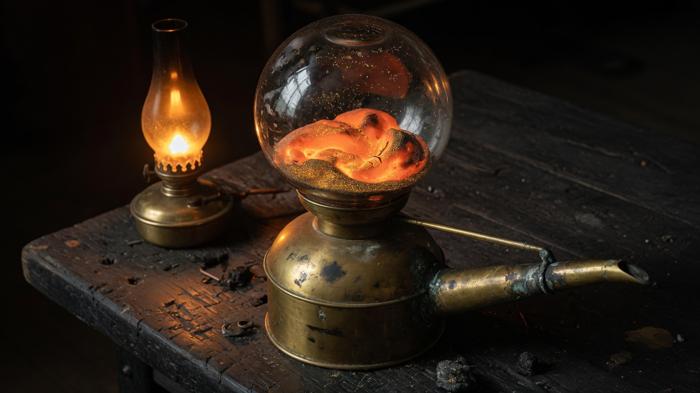

# Alembic

<p align="center">
  
</p>

<p align="center"><em>Charge the vessel. Let go. Watch what the glass decides.</em></p>

A paint-and-watch falling-sand toy dressed as an alchemist's retort. There is no
score. The garden runs whether you touch it or not. New reagents are
**transmuted**, not picked from a warehouse palette. A few doors only open if
you build them.

480×270 grains, stepped in TypeScript, drawn through a Three.js nearest-neighbour
upscale — heat haze, water caustics, gold spark, blast shake, Magnum Opus aurora.

## Play

```bash
npm install
npm run dev      # http://localhost:5173/
npm test
npm run typecheck
```

The vessel draws at 480×270 grains. Chrome nearest-neighbour upscales that buffer — it should not shade a 4K framebuffer for a pixel grid. In Chrome: ⋮ → **Cast, save, and share** → **Install page as app**, or **More tools** → **Create shortcut** → Open as window. That is the standalone window; no Electron.

The vessel boots charged: dunes that crawl if you wait, a trough with a silver
thought, ice, a glass cup of lava, two red casks by the wood, and an unlit
obsidian frame in the sky. Don't sneeze.

| Hand              | Work                                              |
| ----------------- | ------------------------------------------------- |
| Hold / drag left  | Pour. A still hold keeps dripping.                |
| Right-click       | Name the grain under the cursor.                  |
| Hold right + drag | Pan once zoomed.                                  |
| Scroll            | Zoom toward the cursor. Double-click resets.      |
| Alt-click         | Sample that grain onto the brush (and unlock it). |
| Space             | The vessel holds.                                 |
| `[` `]`           | Brush size. `1`–`0` the first ten reagents.       |
| ½× / 1× / 2×      | Clock.                                            |

Clear empties the glass. Reset restores the opening scene. Discoveries stay.

## The Work

Start with sand, water, stone, seed, oil, fire, air, ice, wood, salt, lava,
acid, lead, and tnt. Everything else is earned in the vessel.

- Seed + water (or mud) → **plant**. Wet thickets drop more seed. Ash is bone-meal.
- Fire + sand → **glass**. Fire without fuel → **ash**. Fire + water → **steam**.
- Ash + water → **mud**. Mud + fire → **brick**. Moss creeps along wet stone.
- Oil floats and burns. Salt drinks and becomes **brine**; hot brine leaves **crystal**.
- Ice freezes water; fire **and ember** melt ice. Crystal hanging over air, beside ice, **drips**.
- Heat is a field: T' = T + (α/32)∇²T, Newton's cooling, latent heat on phase change. Metals conduct; glass and wood hold still. Hot water rises. Warm sand reads amber.
- Wood throws **ember**. An ember melts ice even in a wet pool, then quenches to steam. Lava quenches in water as **obsidian** + steam.
- Steam + crystal → **aether**. Acid + lead → **mercury**. Mercury + lead + fire → **gold**.
- Gold + aether + crystal → **azoth**. Azoth turns nearby lead to gold without the fire.
- Salt + ash → **powder**, a fuse that burns one hop a tick.
- Fire boxed in eight obsidian → **void**. It spreads through living stuff; azoth keeps it back.
- Acid eating stone sometimes yields **lead**, rarely gold.
- Sand that settles on brine petrifies. Sand falling into a pool **splashes**.
- A gold column six high, kissed by aether at the tip, **strikes** fire at the base.
- An obsidian frame (inner hole at least 2×2) lit with fire becomes a **rift**. What touches it forgets its name.
- **Tnt** on the bench. Fire, ember, lava, or a fuse. Obsidian / azoth / rifts hold. Nearby casks chain. Sand gets thrown.
- Oil + powder → **nitro**. Meaner hole.
- The dune keeps **mites**. They graze plant and bloom, flee heat, and steal gold grain by grain — a laden mite walks the colour of the king. Mud against plant hatches more. They are not on the bench; they were already here.
- The trough keeps **minnows**. They school, eat a mite that touches the water, and die in oil. Beside crystal they sometimes leave a **pearl**.
- A wet thicket opens **bloom**. Steam that gathers as a cloud against the ceiling falls as dew.

There are rites. The name on the page can be struck. Old sequences still work.
A few words from the art, typed into the dark, are answered.

## Layout

| File               | Role                                     |
| ------------------ | ---------------------------------------- |
| `src/grid.ts`      | Cell ids, shade, occupancy, line stamps. |
| `src/materials.ts` | Palette, colour, density, kind.          |
| `src/sim.ts`       | Motion, reactions, blast kick.           |
| `src/secrets.ts`   | Title strikes, konami, named rites.      |
| `src/codex.ts`     | Whispered lines on first sight.          |
| `src/feel.ts`      | Boom and chime.                          |
| `src/render.ts`    | `blitGrid`, flicker, sparkle, occlusion. |
| `src/stage.ts`     | Three.js DataTexture quad + 2d fallback. |
| `src/view.ts`      | Zoom / pan math.                         |
| `src/world.ts`     | Size, brushes, opening scene.            |
| `src/main.ts`      | Hands, HUD, curtain, RAF.                |
| `src/rng.ts`       | Seedable PRNG.                           |
