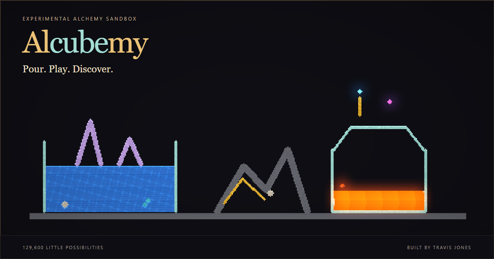
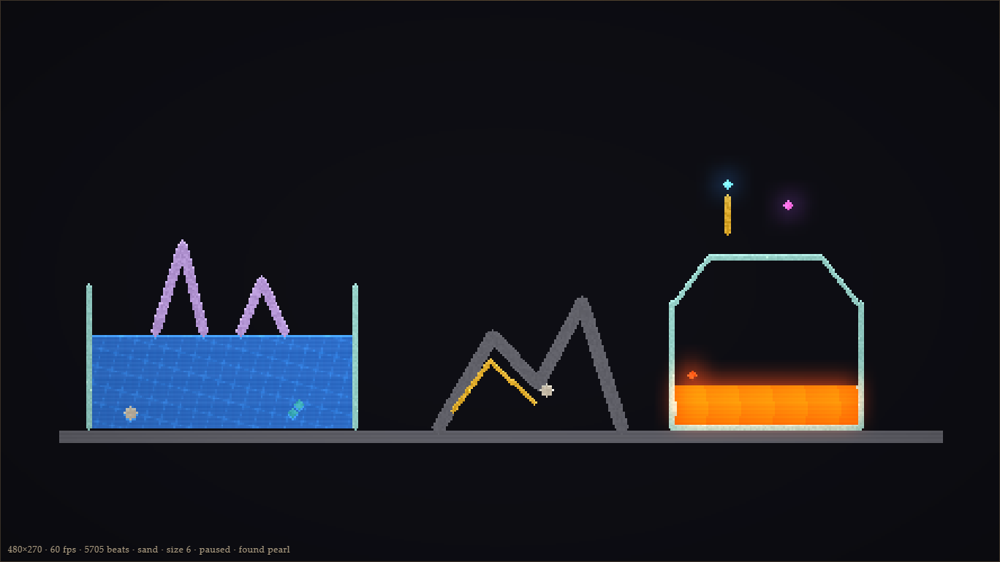
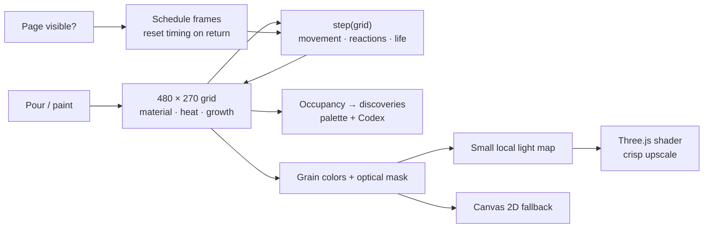

<p align="center">
  
</p>

<p align="center"><strong>A little sand. A little alchemy. A lot of “what happens if?”</strong></p>
<p align="center">Experimental browser sandbox · TypeScript + Three.js · 480 × 270 living pixels</p>
<p align="center"><a href="#start-pouring">Run it locally</a> · <a href="#three-small-experiments">Try an experiment</a> · <a href="#inside-the-glass">See the engineering</a> · <a href="#where-this-goes-next">Follow the adventure</a></p>

# Al**cube**my

Paint a dune. Pour a lake. Grow something, then find out whether it survives your next idea.

Alcubemy is a falling-sand art toy inside an alchemist’s vessel. Sand piles up, oil floats, heat travels, plants grow and little creatures get on with their lives. Reactions reveal new materials on your palette. There is no score, no account and no correct picture.

**Make a little beautiful trouble.** Pause to compose. Let go to see what the world does with it.

> **First release: experimental sandbox.** The local game is playable. Living construction is on the roadmap. This repository does not yet advertise a public hosted release. Previously named Alembic; the repository URL and historical design notes retain that name.

## Three small experiments

| Try this                                                                       | Watch for                                                                                            |
| ------------------------------------------------------------------------------ | ---------------------------------------------------------------------------------------------------- |
| Build a stone bowl. Add water, then a little oil. Touch the surface with fire. | A floating fuel layer, steam and changing light.                                                     |
| Put seed beside water or mud. Leave it alone, then add a little ash.           | A garden that depends on its local surroundings. Time helps a nourished plant; dry ground stays dry. |
| Pour water against lava.                                                       | A bright seam cooling into obsidian, with steam carrying the aftermath upward.                       |

The opening vessel already contains a dune, a trough, mites, minnows and a glass cup of lava. You can start by watching. Or clear the glass and make your own miniature disaster.

<p align="center">
  
  <br /><em>A composed material study, captured from the game renderer. This is not the opening scene.</em>
</p>

## Light belongs to the material

Lava spills orange light. Aether carries a cool halo. Water catches moving caustics. Heat bends the image; metal and crystal catch small glints. The grains stay crisp.

The presentation uses **Three.js shaders and a small light map**, not hardware RTX or path tracing. It shades the simulation-sized buffer, then scales it up. A Canvas 2D fallback keeps the simulation playable without WebGL2, with simpler visuals. Reduced-motion mode removes decorative motion and shake; the pause button stops the simulation.

Background tabs stop scheduling simulation and rendering. Returning starts a fresh frame clock, without replaying the time you were away. Your manual pause remains yours.

## Start pouring

Validated with Node.js 22 and npm. These commands work in PowerShell, Bash and a normal terminal. The experimental release currently lives on `codex/living-retort`:

```sh
git clone --branch codex/living-retort https://github.com/CosmonautJones/falling-sand.git
cd falling-sand
npm ci
npm run dev
```

Open the local URL Vite prints. For a production build, run `npm run build`, then `npm run preview`. Deploy the resulting `dist/` directory to a static host at its root. No application server is required.

The [Netlify handoff](docs/deployment.md) includes the build configuration, proposed subdomain and portfolio card copy. Hosting is not yet verified.

| Control                    | What happens                                 |
| -------------------------- | -------------------------------------------- |
| Left hold / drag           | Pour continuously.                           |
| Touch hold / drag          | Pour on a phone or tablet.                   |
| Right-click                | Name the grain under the cursor.             |
| Right-drag                 | Pan when zoomed.                             |
| Mouse wheel / double-click | Zoom toward the cursor / reset the view.     |
| Alt-click                  | Sample a grain onto the brush and unlock it. |
| Space / pause button       | Hold the simulation. You can still paint.    |
| `[` / `]`                  | Change brush size.                           |
| `1`–`0`                    | Select the first ten starter materials.      |
| ½× / 1× / 2×               | Change simulation speed.                     |
| Codex                      | Read the materials you have found.           |

**Clear** empties the vessel. **Reset** restores the opening scene. Discoveries survive those two buttons within the session. Reloading loses the world and discoveries; saves and undo are not implemented. Touch pouring is supported; mouse probing, zoom and pan are desktop controls.

The manifest includes app icons for browsers that offer installation. Offline caching is not implemented.

## A few doors are hidden

Fourteen starter reagents open into a palette of 37 materials, including air. Some discoveries are chemistry. Some are life. Some are a very bad idea near your garden.

The title is more than lettering. Old game sequences still mean something. The dark knows a few alchemical words.

<details>
<summary><strong>Open the forbidden notebook: selected recipes and secrets</strong></summary>

- Fire + sand → glass. Mud + fire → brick.
- Salt dissolves into brine. Hot brine can leave crystal.
- Steam + crystal → aether.
- Acid + lead → mercury. Mercury + lead + fire → gold.
- Gold + aether + crystal → azoth.
- Salt + ash → powder. Oil + powder → nitro.
- A gold column six grains high can strike when aether touches its tip.
- Fire enclosed by eight obsidian neighbors can become void.
- An obsidian frame with an inner hole at least 2 × 2 can become a rift when lit.
- Strike the title seven times. Try the Konami sequence. Type `nigredo` or `hermes`.

These are sandbox rules, not a model of real chemistry. Void and rifts already exist; orbiting black holes and anti-gravity do not.

</details>

## Inside the glass

The animation **is the simulation**: `step(grid)` moves grains and runs local reactions. The renderer reads the result. Optical glow never feeds back into temperature, growth or creature behavior.



| Where to look                                                                                      | What lives there                                                    |
| -------------------------------------------------------------------------------------------------- | ------------------------------------------------------------------- |
| [`src/grid.ts`](src/grid.ts), [`src/materials.ts`](src/materials.ts)                               | Grain state, occupancy, material properties and palette boundaries. |
| [`src/sim.ts`](src/sim.ts)                                                                         | Local movement, heat, reactions, creatures and blasts.              |
| [`src/world.ts`](src/world.ts)                                                                     | The opening vessel.                                                 |
| [`src/render.ts`](src/render.ts), [`src/optics.ts`](src/optics.ts), [`src/stage.ts`](src/stage.ts) | Grain colors, material-aware light and presentation.                |
| [`src/main.ts`](src/main.ts), [`src/visible-loop.ts`](src/visible-loop.ts)                         | Hands, discovery, UI and visible-page scheduling.                   |
| [`src/secrets.ts`](src/secrets.ts), [`src/codex.ts`](src/codex.ts)                                 | Rites and the notebook of discoveries.                              |

```sh
# One worker keeps the large-grid tests friendlier to memory.
npm test -- --maxWorkers=1 --minWorkers=1
npm run lint
npm run build
```

Tests cover local rules and full-vessel behavior. They cannot tell you whether a creature huddle looks alive or whether a shader is pleasant to watch. Launch evidence and remaining release gates belong in the [release QA record](docs/release-qa.md).

## Where this goes next

The direction is [The Living Retort](docs/superpowers/specs/2026-09-10-living-retort-design.md): small experiments, living construction and beautiful consequences worth keeping.

| Now                                                                                   | Next                                                               | Still an idea                                                                           |
| ------------------------------------------------------------------------------------- | ------------------------------------------------------------------ | --------------------------------------------------------------------------------------- |
| Paint, react, discover; slow heat and locally nourished growth; material-aware light. | Donor mud and supported construction that survives full-vessel QA. | Artwork keepsakes, unusual gravity, black-hole lensing and further optical experiments. |

The next creature milestone must earn its place: no frozen huddles, no stripped hatch nests, no walls falling into a pancake. A green test suite is the beginning of that review.

Found an unexpected interaction? [Open an issue](https://github.com/CosmonautJones/falling-sand/issues) with the ingredients, a screenshot or short clip, and what happened. Beautiful accidents count.

---

Built by **Travis Jones**. If the vessel gives you a good five minutes, a star helps someone else find it.
